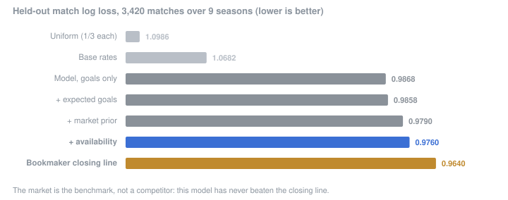
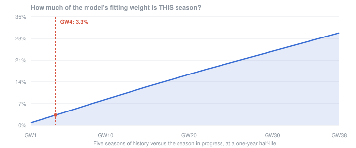
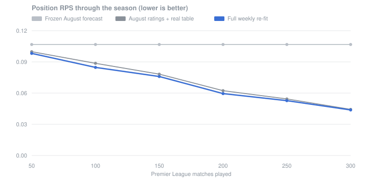

# Premier League Prediction System

A from-scratch football forecasting system for the English Premier League: an Elo
power rating, a Dixon-Coles style goal model, and a rolling out-of-sample backtest
scored against bookmaker odds.

Built to make genuine predictions for the 2026-27 season, not just to demonstrate
technique — so every component is validated against something external rather than
declared correct.

---

## Headline result

Rolling backtest, **9 held-out seasons** (2017-18 → 2025-26, **3,420 Premier League
matches**). Hyperparameters were selected on earlier seasons only and frozen before
these were scored.

| Predictor | Log loss | RPS |
|---|---:|---:|
| Uniform (⅓ each) | 1.0986 | 0.2388 |
| Base rates (from training data only) | 1.0682 | 0.2333 |
| **This model** | **0.9868** | **0.2050** |
| Bookmaker market (Bet365 **opening**, de-vigged) | 0.9578 | 0.1955 |

**The model beats the base-rate baseline by 0.081 log loss.** It does not beat the
market in any of the nine seasons — which is the expected result, and the reassuring
one. A goals-only model with no injury, lineup or expected-goals data should not
outprice a bookmaker; a result claiming otherwise would be evidence of a bug, not of
skill.

### Measured against the closing line

Opening odds are a softer benchmark than they look. The **closing** line has absorbed
team news, weather and the market's own money right up to kick-off, and is the
recognised standard. Closing prices are available from 2019-20, so on those 7 seasons:

| Benchmark | Log loss | Our gap |
|---|---:|---:|
| Bet365 opening | 0.9689 | +0.0322 |
| Bet365 **closing** | 0.9640 | **+0.0370** |
| Market-average **closing** (sharpest) | 0.9639 | **+0.0371** |

**So the honest figure is 0.037 behind the closing line, not 0.029.** The closing
line is ~0.005 log loss sharper than the open, which is itself a small validation
that the de-vigging and comparison machinery are behaving sensibly.

**The probabilities are calibrated, not just accurate on average.** Binning
predicted probability against realised frequency, no bin with n>100 deviates by
more than |z| = 2. A model can post a respectable log loss while being
systematically overconfident, so this is checked explicitly.

### Every layer, and what each one bought

Since that baseline, three layers have been added. Each was kept only because it
improved the same held-out backtest, with its hyperparameters chosen on earlier
seasons and frozen first:



The shipped model scores **0.9760**, against **0.9640** for the closing line — a
remaining gap of 0.0120. Two proposed layers were tested identically and
**rejected**: a market blend (the tuner chose weight 0.00) and squad market value,
which made things worse once the market prior was already applied. Those negative
results are kept in the repo rather than deleted.

---

## What it does

Three levels, two of them built:

- **Match level** — win/draw/loss probabilities, expected goals, likeliest scoreline
- **Team level** — Elo power ratings across two divisions and 26 seasons
- **Season level** — Monte Carlo simulation: title, top-four and relegation
  probabilities with full points and position distributions
- **Live** — a weekly harness that refreshes results, re-fits, re-simulates and
  writes a dated snapshot, building a week-by-week history of how the forecast moved

---

## Architecture

```
football-data.co.uk CSVs  ─┐
                           ├─→  load_results.py  ─→  matches_combined.csv
teams.csv (name mapping)  ─┘                            24,232 matches
                                                        2000-2026, 2 divisions
                                     ┌──────────────────────┴───────────┐
                                     ↓                                  ↓
                          elo.py / build_elo.py              dixon_coles.py
                          Elo + cross-division                Poisson goal model
                          re-anchoring                        joint two-division fit
                                     │                                  │
                                     ↓                                  ↓
                          benchmark_elo.py                      backtest.py
                          validated vs ClubElo                  rolling, nested,
                          (Spearman 0.955)                      vs market baseline
                                                                        │
                                                                        ↓
                                                                 simulate.py
                                                                 Monte Carlo season
                                                                        │
                              FPL API ─→ fixtures.py ─────────────→ harness.py
                              380 fixtures + results          weekly dated snapshot
```

### The Elo engine

Standard Elo with home advantage and a goal-difference multiplier, replayed over all
24,232 matches. The hard part is that the Premier League and Championship pools drift
apart over 25 years — they swap only three teams a season and never play each other,
so promoted sides arrived looking like top-six Premier League teams.

The fix is **per-season league re-anchoring**: the entire Championship pool slides as
a rigid block so its mean sits a fixed distance below the Premier League's, preserving
within-league order while removing the inter-league drift.

That distance was **measured, not assumed** — 232 Elo points, derived from the
points-per-game change across 75 promotions and 75 relegations.

**Validation:** Spearman rank correlation **0.955** against
[ClubElo](http://clubelo.com), an established independent rating system, across 43
shared clubs.

### The goal model

Attack and defence ratings per team by weighted maximum likelihood:

```
λ_home = exp(c + attack_home − defence_away + γ)
λ_away = exp(c + attack_away − defence_home)
```

fitted jointly across both divisions with exponential time decay, plus the
Dixon-Coles low-score correction term ρ.

**The interesting problem here is cross-division identification.** Adding a constant
to every Championship team's attack *and* defence leaves every within-Championship
prediction unchanged — so the relative scale of the two divisions is a flat direction
in the likelihood. Since league fixtures are never cross-division, the *only* thing
that identifies it is teams which played in both divisions inside the training window.

Measured: a one-season training window contains **zero** such teams and is formally
unidentified. Three seasons has 7, five has 14. Hence a five-season default, and a
deliberately gentle time decay — an aggressive half-life strips out precisely the
older-division matches carrying the linking information.

**The result cross-validates the Elo work.** The goal model *learns* a division gap
of 267 Elo-equivalent points; the Elo engine *independently derives* 232 from
points-per-game data by a completely different route. Two methods, one estimated and
one measured, landing in the same place.

### The season simulator

Match probabilities are turned into season outcomes by sampling a full **scoreline**
for every remaining fixture — not just a win/draw/loss — so goal difference, and
therefore the tie-breaks that actually decide titles, come out right. 10,000 seasons
take under a second.

Its correctness is pinned to reality rather than eyeballed: with every match played
the simulator reproduces the real final table exactly, for all 20 teams, in points
*and* position. Simulated mean points also match analytically computed expected
points to within 0.13 across the league.

**The uncertainty was wrong at first, and fixing it mattered more than the point
estimates.** Drawing each fixture independently assumes a team's strength is exactly
its rating. In reality that rating is both estimated with error and wrong in ways
that persist all season, so a side that is genuinely better than rated is better in
all 38 matches at once. Measured on held-out seasons, only **63.9%** of actual points
totals fell inside the predicted 10–90% band, and the probability integral transform
rejected calibration at p = 0.012.

Adding a per-team season-long strength draw — one parameter, tuned on earlier
seasons — moved that to **75.0%** coverage with PIT p = 0.65: from *demonstrably
overconfident* to *indistinguishable from calibrated*.

### Live 2026-27 forecast

`fixtures.py` pulls all 380 fixtures from the FPL API; `harness.py` re-fits,
re-simulates and writes a dated snapshot recording the model that produced it
(window, half-life, dispersion, git commit), so a mid-season model change is visible
in the history instead of silently rewriting it.

Validated by dry-running the whole harness over the completed 2025-26 season: the
champion's title probability climbs 29% → 100% as results arrive, and the final
snapshot reproduces the real table exactly. That dry run caught a real
double-counting bug that would otherwise have corrupted every live weekly snapshot.

### Promoted teams: the hardest problem, and where the market comes in

The single largest error in the model was newly promoted teams. A promoted side's
rating is derived from Championship form — and **Championship form does not predict
Premier League performance**: across 75 promotions the correlation between a team's
Championship points and its subsequent Premier League points is **+0.004**. The model
was extrapolating confidently from a predictor that does not predict. That is how it
gave Sunderland a 96.3% relegation probability in 2025-26. They finished 7th.

Three things were tried, and only the third worked:

1. **Squad market values from Transfermarkt** — blocked. The dataset covers the
   Premier League only; the promoted teams we most need to value are precisely the
   ones absent from it.
2. **Features we already had** — parachute payments, promotion route, Championship
   points. All null: combined R² = 0.024.
3. **The bookmaker odds we'd been using only as a scoreboard** — this worked.

Bookmakers price a promoted side's opening fixtures knowing the summer transfers,
the manager and the squad overhaul that a goals-only model cannot see. Across 63
promoted team-seasons, the expected points per game implied by the market's first six
fixtures correlates **+0.382 (p=0.002)** with that team's final points, against +0.147
(not significant) for our own rating.

So we read a strength offset off those prices and use it to rate the team for the
whole season — including the May fixtures nobody will price for months.

**This is not the blend that failed.** That combined a match prediction with the same
match's price and added nothing. This moves information from the small *priced* set to
the large *unpriced* one, which is the only place the market cannot help directly. It
is also the architecture this project set out to match: a power rating, informed by
the market, driving a Monte Carlo simulation.

Held out, with the prior-building fixtures excluded from scoring:

| | Log loss | Change |
|---|---:|---:|
| All fixtures | 0.9884 → **0.9829** | +0.0055 |
| **Promoted-team fixtures** | 0.9668 → **0.9446** | **+0.0222** |
| Gap to the market on promoted fixtures | +0.0462 → **+0.0240** | halved |

What it does in practice: our model rated Sunderland and Burnley about the same in
August 2025. The market separated them — Sunderland +0.290, Burnley −0.236. They
finished **7th on 54 points** and **19th on 22**.

**Honest limits.** The prior *imports* market information rather than discovering
anything new, so it cannot make the model better than the market — re-running the
blend test confirmed the weight stays at zero. And promoted teams remain the least
predictable part of the league: even with the prior their season-points intervals
cover at 70% against a nominal 80%.

### The expected-goals layer

Goals are a noisy measure of how well a team played — a 1-0 win off one shot and a
1-0 win off twenty look identical. Expected goals measures chance quality instead, so
it should be a cleaner read on true strength.

That premise checks out. Across 240 team-seasons, first-half xG predicts a team's
second-half **goals** better than first-half goals do (r = +0.719 vs +0.666 for
attack; +0.601 vs +0.519 for defence).

It enters the model without changing the model: goals are still Poisson with the
low-score correction, but the *estimation target* becomes `κ·xG + (1−κ)·goals`, a
quasi-Poisson. κ=0 reproduces the goals-only model exactly, so the A/B test is part
of the parameterisation rather than bolted on.

**The payoff is real but small — held-out log loss 0.9868 → 0.9858.** Two findings
were more interesting than the gain:

- **Pure xG is worse than pure goals** (0.9890 vs 0.9868). Finishing quality isn't
  purely noise, and discarding goals discards real signal.
- **Understat covers the Premier League only**, so Championship matches fall back to
  goals. That mixed measurement costs about half the benefit: a Premier-League-only
  fit gains +0.0021 against +0.0010, and the learned division gap slides from 204 to
  183 as κ rises — the two divisions being measured with different instruments.
  Championship xG would fix it; no free source has it.

---

## Does re-running it every week actually do anything?

Every figure above comes from a forecast made on **1 August**. But the live product
is a *weekly* re-run, and that had never been graded — a model can be perfectly
calibrated pre-season and still add nothing from gameweek 12 onward.

The reason to suspect it might not is this. Time decay has a one-year half-life, so
the season in progress is a small fraction of what the model is actually fitted on:



Four gameweeks in, this season is **3.3%** of the fitting weight. It does not reach
a third until the season is over. So `checkpoint_backtest.py` scores three arms at
six points in each of nine held-out seasons, against the same final table:

- **frozen** — the August forecast, never touched again
- **banked** — August's *strength estimates*, but simulated from the real current
  table. Points counted, nothing re-learned.
- **refit** — the full weekly re-fit, which is what the live harness does



**Re-fitting does beat simply counting the table** — position RPS improves by
**+0.00214**, better in **36 of 54** season-checkpoints, t = +4.65, **p < 0.0001**.
The gain peaks at 100 matches played (+0.0039, better in **9 seasons out of 9**) and
decays to nothing by 300. Relegation log loss improves significantly at the
150-match checkpoint (−0.0110, better in 7/9, p = 0.039).

**But the honest headline is the gap between the two lower lines, not between
them.** Banking points dominates the model's contribution at every checkpoint. At
300 matches played, relegation log loss improves 0.315 → 0.099 from counting the
table, and 0.099 → 0.099 from re-fitting. Late in a season, the league table is
doing essentially all of the work.

**A finding that did not survive.** In the aggregated tables, re-fitting appeared to
*hurt* the title market from 150 matches on, across four consecutive checkpoints —
which looked like a real effect with a tidy mechanism behind it. Paired properly by
season it evaporates: mean +0.0057, worse in 5 of 9 seasons, **p = 0.18**. Four
correlated aggregates are not four observations. It is recorded as suggestive and
nothing was changed on the strength of it.

---

## Things that turned out to be wrong

Kept here deliberately — the debugging is the part worth reading.

**The Dixon-Coles correction drifts, so hardcoding it would be wrong.** rho is
fitted rather than assumed, and tracking it across training windows shows it is not
a fixed property of football at all:

| Window ending | rho |
|---|---:|
| 2018-19 | -0.058 |
| 2021-22 | -0.010 |
| 2024-25 | +0.015 |
| 2025-26 (current) | **-0.053** |

The classic 1997 correction was clearly present in older data, faded to nothing
around 2022-2025 (Poisson predicted the overall draw rate to within 0.3%), and has
returned on the latest window -- driven by a surge in 1-1 draws, whose frequency
rose from 0.105 to 0.140 over three seasons while the overall draw rate went from
0.24 to 0.27.

An earlier version of this README claimed the correction "does nothing on modern
data". That was true of the window then being tested and wrong as a general
statement. The durable lesson is the opposite of a fixed value: **hardcoding the
textbook -0.05 would have been wrong in 2024, and hardcoding 0 would be wrong
now.** Fitting the parameter is what lets the model follow the change.

**A ridge penalty silently destroyed the main result.** Shrinking attack/defence
toward zero also shrinks the *gap between divisions*, because Championship teams sit
below zero and Premier League teams above — it biased the exact quantity the joint
fit exists to estimate, collapsing the learned gap from 266 to 73 Elo-equivalent and
making promoted teams look far stronger than they are.

**A passing sanity check hid a misspecified model.** An earlier fit recovered a
home advantage of 0.33, which looked right and was accepted. It was inflated: the
model had no intercept term, so the home-advantage parameter was absorbing the
overall goal level as well. The tells were only visible in checks that could fail
*structurally* — away goals under-predicted by 5.3%, and the parameter drifting with
window length when a stable parameter shouldn't care. The corrected value is ~0.21.

---

## Honest limitations

- **The Championship model is weak.** Log loss 1.0658 against a base rate of 1.0777 —
  it adds very little, and is measurably overconfident in the 0.5–0.6 probability
  band (predicted 0.541, realised 0.481, z = −4.05). Reported rather than buried.
- **The gap to the market is widening**, and the cause is now identified: it is almost
  entirely **promoted teams**. On held-out seasons the deficit is +0.047 on matches
  involving a promoted side versus +0.022 on established sides only, and the widening
  trend is significant for the former (slope +0.011/season, p=0.014) but not the
  latter (p=0.48). In 2025-26 the split was +0.141 against +0.012.

  Notably, the market's own absolute performance is **flat** over the same period
  (p=0.30), so this is not "bookmakers got better" — it is our Championship-derived
  ratings failing to price newly promoted squads, which are reshaped by transfer
  spending the model cannot see.
- **The season product has never been scored against a bookmaker.** Title, top-four
  and relegation probabilities are validated against base rates and against last
  season's table, but outright market prices were not being archived until
  September 2026. Every weekly run now freezes that week's prices, so the comparison
  switches on by itself once 2026-27 finishes — and `market_status()` prints the
  fact that it cannot run yet rather than letting it be quietly forgotten.
- **The weekly re-fit adds little after about gameweek 25.** Measured, not assumed;
  see the checkpoint backtest above. The league table, not the model, carries a
  late-season forecast.
- **Championship expected goals do not exist** in any free source. Understat covers
  the Premier League only, so at high xG weights the two divisions are measured with
  different instruments — which is visible as the learned division gap sliding from
  204 to 183 Elo-equivalent as the xG weight goes 0 → 1. It costs roughly half the
  benefit of the xG layer.
- **The hyperparameter surface is nearly flat** (0.9796–0.9841 across all twelve
  combinations tried), so the selected window and half-life shouldn't be read as
  meaningful — they're within noise of each other.

---

## Running it

```powershell
py -m venv venv
venv\Scripts\activate
py -m pip install -r requirements.txt

py src\load_results.py    # build the clean match table from raw CSVs
py src\build_elo.py       # replay all matches, produce Elo ratings
py src\dixon_coles.py     # fit the goal model, division-gap diagnostics
py src\backtest.py        # the full rolling backtest (the headline number)
py src\benchmark_elo.py   # validate Elo against ClubElo (requires network)
```

Everything except `benchmark_elo.py` runs offline from data in the repo.

**Weekly, during the season:**

```powershell
py src\fixtures.py             # refresh results from the FPL API
py src\harness.py              # re-fit, re-simulate, write a dated snapshot
py src\dashboard.py            # render dashboard.html from that snapshot
git add data\ && git commit    # the snapshot history IS the deliverable
```

**Validation suites:**

```powershell
py src\season_backtest.py      # title / top-four / relegation, held out
py src\checkpoint_backtest.py  # does the weekly re-run help? (~11 min)
py src\validate_all.py         # 54 assertions across the whole pipeline
py src\figures.py              # regenerate the charts in this README
```

Heed the staleness warning: if the harness reports fixtures past kick-off with no
result, the feed has not updated and those matches are being *simulated* rather
than counted.

---

## Roadmap

| Phase | Status |
|---|---|
| 1. Data sourcing & catalogue | ✅ |
| 2. Clean results loader (24,232 matches, table-verified) | ✅ |
| 3. Elo engine (validated vs ClubElo, 0.955) | ✅ |
| 4. Dixon-Coles model + backtest | ✅ |
| 5. Market blend | ✅ tested — **it does not help**, see below |
| 6. Season simulator (Monte Carlo, calibrated) | ✅ |
| 7. Live 2026-27 harness with weekly snapshots | ✅ |
| 8. Promoted-team ratings via market-implied priors | ✅ |
| 9. Expected-goals layer (Understat), A/B tested on the backtest | ✅ |
| 10. Player-level model (minutes, goals, assists) | next |

**Phase 5 is a negative result, kept deliberately.** Blending model probabilities
with the market in log space was tuned out-of-sample and made things slightly
*worse* (0.9583 against the market's 0.9578); in the Championship the optimiser set
the model's weight to zero outright. The honest conclusion is that this model
carries essentially no information the market lacks — so for matches with odds, use
the odds. The project's contribution is the season-level distributions the market
does not publish, which cannot be blended because August simulation requires
predicting unpriced May fixtures.

---

## Data sources & attribution

- **[football-data.co.uk](https://www.football-data.co.uk/)** — results, match stats
  and bookmaker odds, 2000-2026. The historical spine of the project.
- **[ClubElo](http://clubelo.com)** — independent Elo ratings, used as an external
  benchmark.
- **[Understat](https://understat.com)** — expected goals *(Phase 8)*.
- **[Transfermarkt-datasets](https://github.com/dcaribou/transfermarkt-datasets)** —
  transfers and market values. The ~195 MB DuckDB file is **not** committed; download
  it from the upstream project.
- Accessed via [`soccerdata`](https://github.com/probberechts/soccerdata).

Odds are de-vigged by proportional normalisation. Residual miscalibration is
consistent with the well-documented favourite–longshot bias rather than an error in
the de-vigging: longshots are over-priced and favourites under-priced, with the sign
flipping cleanly across the probability range.

---

## Licence

MIT — see [LICENSE](LICENSE). Third-party data remains subject to the terms of its
original providers.
